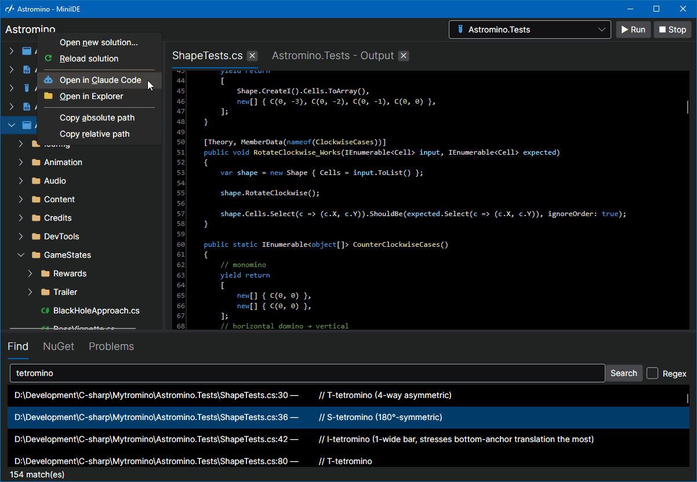

**tl;dr:** this is an experimental C# IDE, intended to be used alongside an external agentic AI that runs in its own thang (such as Claude Code's TUI (flawed though it may be)).

it used to support free-text input - you know, like a normal editor - but I decided to make it a "read-only IDE", and am adding refactor tools, instead. (read-only solves more problems than allowing live editing solved.)

> 🧚 **hey, listen!** [you can support my development of open-source software on Patreon](https://www.patreon.com/BenMakesGames), and/or [check out my game Astromino, on Steam!](https://store.steampowered.com/app/4644350/Astromino/)

### why?

I love Rider - it's been my favorite C# IDE for years - but like all IDEs, it's a resource hog that eats laptop batteries for breakfast, and I get why: Rider & Visual Studio are built to support every use case anyone ever wanted and asked for.

but of all the features Rider offers, I've only used very few; with agentic AIs, I use fewer still. *I barely type code at all anymore!*

(I've tried vscode various times over the years: its UI/UX is simply not to my liking, and their C# support has always lagged, _and_ it's an electron app?! that's extra weight++!)

so, like any ridiculous dev, I've decided to "just" make my own...

### my must-haves

~~ultimately: to reach a point where I'm comfortable uninstalling Rider.~~ I did it :P

| feature                                | status                  |
| -------------------------------------- | ----------------------- |
| syntax highlighting (C#, JSON, XML)    | ✅                       |
| a decent-ish & modern-ish look & feel  | ✅                       |
| jump to declaration                    | ✔ - could use a UI pass |
| find usages                            | ✔ - could use a UI pass |
| global search, w/ regex if you want it | ✔ - could use a UI pass |
| solution-wide warnings & errors view   | ✔ - could use a UI pass |
| NuGet package management               | ✔ - could use a UI pass |

### my nice-to-haves

| feature                                                | status                 |
| ------------------------------------------------------ | ---------------------- |
| navigate interface implementations & inheritance trees | ❌                      |
| nice test result UI (not just console output)          | ❌                      |
| highlighting warnings & errors                         | ❌                      |
| rename symbol                                          | ❓ - needs more testing |
| other refactors?                                       | ❌                      |

### my GTFOs

1. custom window chrome
2. scanning the entire solution when the IDE starts up
3. settings that require a built-in search tool
4. hand-typed edits — the editor is a read-only window onto an authoritative disk; external tools (the agentic AI, CLI git) do the writing, and the view reconciles disk → view on focus and before every operation. Operation-driven writes (NuGet, refactors) stay. Fixing a one-char typo now goes through the agent or an external editor — deliberately.

